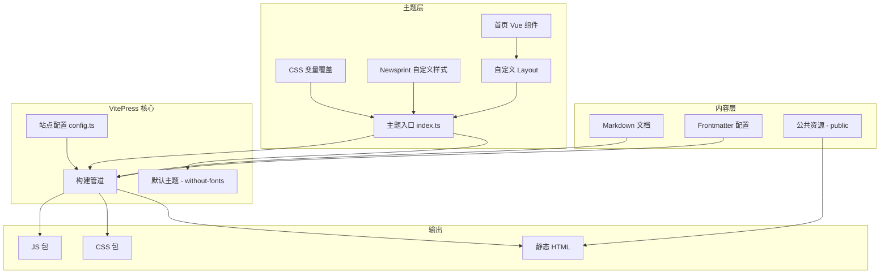

# 技术设计文档：文档站初始搭建

## 概述

**目的**: 搭建 yy-ai-workflow 文档站，为 AI 开发者和团队提供基于 VitePress 的知识平台，采用 Newsprint（报纸印刷）设计系统呈现独特的视觉风格。

**用户**: AI 开发实践者、yy-spec 新用户、团队成员，通过场景驱动的内容组织高效获取工具使用指南和方法论知识。

**影响**: 从零建立文档站基础架构，包含项目初始化、导航结构、首页、内容目录、视觉主题和内容规范。

### 目标
- 建立可运行的 VitePress 文档站，支持 dev/build/preview 工作流
- 实现 Newsprint 设计系统的完整视觉风格
- 创建场景驱动的内容组织结构和导航体系
- 建立可持续维护的内容规范和模板

### 非目标
- 具体文档内容撰写（仅建立结构和占位内容）
- 自动化部署流程（CI/CD）
- 搜索功能定制（使用 VitePress 默认搜索）
- 暗色模式支持

## 架构

### 架构模式与边界图

采用 VitePress 默认的静态站点生成架构，通过主题扩展层实现 Newsprint 视觉风格。



**架构集成**:
- **选定模式**: 扩展默认主题 — 保留 VitePress 开箱即用的导航、侧边栏、移动端适配，仅定制视觉层
- **领域边界**: 内容层（Markdown）与主题层（CSS/Vue）分离，互不耦合
- **保留模式**: VitePress 默认的文件系统路由、自动侧边栏检测
- **新组件理由**: 自定义 CSS 和 Layout 组件用于 Newsprint 视觉风格，默认主题无法直接满足
- **Steering 合规**: 场景驱动组织、渐进深入、零基础读者友好

### 技术栈

| 层 | 选择/版本 | 功能角色 | 备注 |
|---|----------|---------|------|
| 框架 | VitePress ^1.6 | 静态站点生成、Markdown 渲染、路由 | 当前最新稳定版 |
| 运行时 | Vue 3 | 自定义组件、Layout 插槽 | VitePress 内置 |
| 样式 | 原生 CSS + CSS 变量 | Newsprint 设计系统实现 | 不引入 Tailwind 等框架 |
| 字体 | Google Fonts CDN | Playfair Display, Lora, Inter, JetBrains Mono | 通过 head 配置注入 |
| 构建 | Vite | 开发服务器、HMR、静态构建 | VitePress 内置 |
| 运行环境 | Node.js 18+ | 开发和构建 | Steering 约束 |

> 不引入 Tailwind CSS：文档站样式量有限，原生 CSS 变量覆盖 + 自定义 CSS 即可满足需求，避免额外构建依赖。详见 `research.md` 架构方案评估。

## 需求追溯

| 需求 | 摘要 | 组件 | 接口 | 流程 |
|------|------|------|------|------|
| 1.1-1.5 | VitePress 项目初始化 | SiteConfig | 无 | 构建流程 |
| 2.1-2.4 | 站点基础配置 | SiteConfig | 无 | 无 |
| 3.1-3.5 | 导航结构 | SiteConfig, ThemeConfig | NavConfig, SidebarConfig | 无 |
| 4.1-4.4 | 首页 | HomePage, HomeLayout | HeroConfig, FeaturesConfig | 无 |
| 5.1-5.5 | 内容目录结构 | ContentStructure | 无 | 无 |
| 6.1-6.10 | Newsprint 视觉风格 | NewsprintTheme, CustomLayout | CSSVariables | 无 |
| 7.1-7.5 | 内容规范与模板 | ContentTemplate | 无 | 无 |

## 组件与接口

| 组件 | 领域/层 | 意图 | 需求覆盖 | 关键依赖 | 契约 |
|------|---------|------|----------|----------|------|
| SiteConfig | 配置 | VitePress 站点配置 | 1.1-1.5, 2.1-2.4, 3.1-3.5 | VitePress (P0) | 配置 |
| NewsprintTheme | 主题 | Newsprint 视觉风格实现 | 6.1-6.10 | DefaultTheme (P0), Google Fonts (P1) | 样式 |
| CustomLayout | 主题 | 扩展默认 Layout | 6.5, 6.6 | DefaultTheme (P0) | 插槽 |
| HomePage | 内容 | 首页 Markdown + frontmatter | 4.1-4.4 | DefaultTheme Home Layout (P0) | 配置 |
| ContentStructure | 内容 | 目录和文件组织 | 5.1-5.5, 7.1-7.5 | 无 | 约定 |

### 配置层

#### SiteConfig

| 字段 | 详情 |
|------|------|
| 意图 | VitePress 核心站点配置，定义标题、语言、导航、字体加载等 |
| 需求 | 1.1-1.5, 2.1-2.4, 3.1-3.5 |

**职责与约束**
- 定义站点元数据（标题、描述、语言）
- 配置导航栏和侧边栏结构
- 注入 Google Fonts 和 favicon
- 禁用暗色模式

**依赖**
- 外部: VitePress — 站点配置 API (P0)
- 外部: Google Fonts CDN — 字体加载 (P1)

**契约**: 配置 [x]

##### 站点配置接口

```typescript
// .vitepress/config.ts
import { defineConfig } from 'vitepress'

interface SiteConfigShape {
  title: string              // "yy-ai-workflow"
  description: string        // 站点描述
  lang: string               // "zh-CN"
  appearance: false           // 禁用暗色模式
  head: HeadConfig[]          // Google Fonts + favicon
  themeConfig: ThemeConfigShape
}

interface ThemeConfigShape {
  nav: NavItem[]              // 顶部导航
  sidebar: SidebarConfig      // 侧边栏配置
  outline: OutlineConfig      // 页面大纲
  socialLinks: SocialLink[]   // 社交链接（可选）
}

type NavItem = {
  text: string
  link: string
} | {
  text: string
  items: { text: string; link: string }[]
}

interface SidebarConfig {
  [path: string]: SidebarGroup[]
}

interface SidebarGroup {
  text: string
  collapsed?: boolean
  items: { text: string; link: string }[]
}
```

**实现说明**
- Google Fonts 通过 `head` 配置注入 preconnect 和 stylesheet 链接
- `appearance: false` 一行配置禁用暗色模式和切换按钮
- 导航按场景驱动组织，非按模块划分

### 主题层

#### NewsprintTheme

| 字段 | 详情 |
|------|------|
| 意图 | 通过 CSS 变量覆盖和自定义样式实现 Newsprint 设计系统 |
| 需求 | 6.1-6.10 |

**职责与约束**
- 覆盖 VitePress 默认 CSS 变量（颜色、字体、圆角、间距）
- 定义 Newsprint 专属样式（点阵纹理、硬阴影、大写标签）
- 强制 0px 圆角覆盖所有组件
- 确保 WCAG AA 对比度合规

**依赖**
- 内部: DefaultTheme — 基础主题 (P0)
- 外部: Google Fonts — Playfair Display, Lora, Inter, JetBrains Mono (P1)

**契约**: 样式 [x]

##### 主题入口

```typescript
// .vitepress/theme/index.ts
import type { Theme } from 'vitepress'
import DefaultTheme from 'vitepress/theme-without-fonts'
import './newsprint.css'
import CustomLayout from './CustomLayout.vue'

export default {
  extends: DefaultTheme,
  Layout: CustomLayout
} satisfies Theme
```

##### CSS 变量覆盖规范

```
文件: .vitepress/theme/newsprint.css

覆盖范围:
- 颜色系统: --vp-c-bg (#F9F9F7), --vp-c-text-1 (#111111), --vp-c-brand-1 (#CC0000)
- 字体: --vp-font-family-base (Lora), --vp-font-family-mono (JetBrains Mono)
- 圆角: 全局 border-radius: 0px 覆盖
- 边框: 黑色实线边框作为结构分隔
- 背景: 点阵纹理 (4x4px SVG pattern)
- 悬停: 硬偏移阴影 (4px 4px 0px 0px #111111)
- 标签: 大写 + tracking-widest 用于 nav/metadata
```

**实现说明**
- 使用 `vitepress/theme-without-fonts` 避免 Inter 字体捆绑
- 自定义标题字体通过 `.vp-doc h1, h2, h3` 选择器应用 Playfair Display
- 全局圆角重置: `*, *::before, *::after { border-radius: 0 !important; }`
- 点阵纹理通过 `body::before` 伪元素应用

#### CustomLayout

| 字段 | 详情 |
|------|------|
| 意图 | 扩展默认 Layout，注入 Newsprint 增强（纹理层、自定义插槽内容） |
| 需求 | 6.5, 6.6 |

**职责与约束**
- 包裹默认 Layout 组件
- 通过插槽注入背景纹理层
- 预留首页自定义插槽

**依赖**
- 内部: DefaultTheme.Layout — 页面布局 (P0)

**契约**: 插槽 [x]

##### 组件接口

```typescript
// .vitepress/theme/CustomLayout.vue
// 使用 <script setup> + <template>
// Props: 无（继承默认 Layout）
// Slots 使用:
//   - layout-top: 注入全局纹理层
//   - home-hero-info: 可选首页自定义
```

### 内容层

#### HomePage

| 字段 | 详情 |
|------|------|
| 意图 | 首页内容配置，展示项目价值和入口引导 |
| 需求 | 4.1-4.4 |

**职责与约束**
- 通过 frontmatter `hero` 字段配置标题、描述和行动按钮
- 通过 frontmatter `features` 字段配置功能特性区域
- 行动按钮至少包含"快速开始"和"了解方法论"两个入口

**依赖**
- 内部: DefaultTheme Home Layout — 首页渲染 (P0)

**契约**: 配置 [x]

##### 首页 Frontmatter 结构

```typescript
interface HomePageFrontmatter {
  layout: 'home'
  hero: {
    name: string          // "yy-ai-workflow"
    text: string          // 副标题
    tagline: string       // 价值主张描述
    actions: {
      theme: 'brand' | 'alt'
      text: string        // 按钮文字
      link: string        // 目标链接
    }[]
  }
  features: {
    icon: string          // emoji 或图标
    title: string         // 特性标题
    details: string       // 特性描述
    link?: string         // 可选链接
  }[]
}
```

#### ContentStructure

| 字段 | 详情 |
|------|------|
| 意图 | 定义场景驱动的目录结构和内容组织约定 |
| 需求 | 5.1-5.5, 7.1-7.5 |

**职责与约束**
- 按应用场景划分顶级目录
- 每个场景目录包含 `index.md` 作为入口
- 所有命名使用 kebab-case
- `.yy-dev/` 排除在内容之外

**契约**: 约定 [x]

##### 目录结构定义

```
docs/
├── .vitepress/
│   ├── config.ts              # 站点配置
│   └── theme/
│       ├── index.ts           # 主题入口
│       ├── newsprint.css      # Newsprint 样式
│       └── CustomLayout.vue   # 自定义 Layout
├── public/
│   └── favicon.ico            # 站点图标
├── index.md                   # 首页 (layout: home)
├── getting-started/
│   └── index.md               # 快速上手
├── workflow/
│   └── index.md               # 工作流命令
├── methodology/
│   └── index.md               # 方法论（AI-DLC、SDD）
└── .yy-dev/                   # 排除 — 不纳入文档内容
```

##### 内容模板约定

```
每篇文档结构:
1. 标题 (H1)
2. 快速入门段落 — 30 秒内了解核心要点（需求 7.1）
3. 正文内容 — 由浅入深组织
4. 代码示例 — 可直接复制运行（需求 7.3）
5. "下一步"引导 — 链接到相关内容（需求 7.2）

链接约定:
- 文档间交叉引用使用相对链接（需求 7.4）
- 链接格式: [文本](./relative-path.md) 或 [文本](../other-section/page.md)
```

## 测试策略

### 构建验证测试
- `npx vitepress build` 成功完成，无错误或警告
- 输出目录包含 `index.html` 和各场景页面的 HTML
- CSS 包中包含 Newsprint 自定义变量和样式

### 视觉验收测试（手动）
- 背景色为米白 `#F9F9F7`，非纯白
- 所有元素圆角为 0px
- 标题使用 Playfair Display 衬线字体
- 无暗色模式切换按钮
- 导航和标签文字为大写 + 加宽字距
- 悬停交互元素显示硬偏移阴影

### 导航功能测试（手动）
- 顶部导航跳转到正确页面
- 侧边栏高亮当前页面
- 首页行动按钮跳转到正确目标
- 所有内部链接有效（无 404）

### 响应式测试（手动）
- 移动端导航菜单正常工作
- 移动端保持锐角和高对比度特征
- 内容在不同屏幕宽度下可读

## 可选部分

### 性能考虑
- Google Fonts 使用 `display=swap` 避免 FOIT（字体不可见闪烁）
- 字体 preconnect 加速 DNS 解析和连接建立
- VitePress 默认的代码分割和懒加载已满足基本性能需求
- 无额外性能目标（使用 VitePress 默认基线）

### 安全考虑
- 无用户输入处理，纯静态站点，无 XSS/CSRF 风险
- Google Fonts CDN 为受信任的第三方资源
